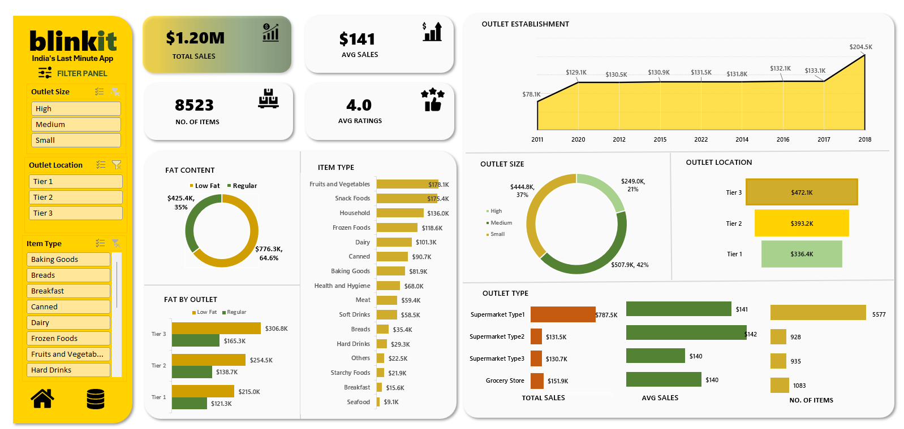

# Excel

# 🛒 Blinkit Sales Dashboard (Excel)

## 📌 Project Overview

This project presents an **interactive sales dashboard built in Microsoft Excel** to analyze Blinkit’s retail data.
The dashboard provides insights into **sales performance, product categories, outlet locations, outlet sizes, and customer preferences** using clear visualizations and KPI indicators.

The goal of this project is to demonstrate **data analysis, data visualization, and dashboard development skills using Excel**.

---

# 📊 Dashboard Preview

---

# 🎯 Business Objective

The main objective of this dashboard is to help stakeholders:

* Track overall **sales performance**
* Identify **top-performing product categories**
* Compare sales across **outlet locations and outlet sizes**
* Analyze **fat content distribution of products**
* Monitor key **business KPIs**

---

# 📈 Key Performance Indicators (KPIs)

The dashboard highlights important metrics such as:

* **Total Sales:** $1.20M
* **Average Sales:** $141
* **Number of Items:** 8,523
* **Average Ratings:** 4.0

These KPIs help quickly understand the overall performance of the business.

---

# 📊 Dashboard Features

## 1️⃣ Outlet Establishment Trend

A line chart showing how sales have evolved over the years based on outlet establishment.

**Insight:**
Helps identify growth trends and expansion impact on sales.

---

## 2️⃣ Fat Content Analysis

A donut chart showing the distribution of:

* Low Fat Items
* Regular Items

**Insight:**
Understanding customer purchasing patterns based on product fat content.

---

## 3️⃣ Item Type Performance

A bar chart displaying total sales by product categories such as:

* Fruits & Vegetables
* Snack Foods
* Household Items
* Frozen Foods
* Dairy
* Canned Products
* Baking Goods
* Health & Hygiene
* Meat
* Soft Drinks

**Insight:**
Helps identify **top-performing product categories**.

---

## 4️⃣ Outlet Size Analysis

A donut chart comparing sales across outlet sizes:

* Small
* Medium
* High

**Insight:**
Shows which outlet size contributes the most to total revenue.

---

## 5️⃣ Outlet Location Analysis

A bar chart analyzing sales by location tier:

* Tier 1
* Tier 2
* Tier 3

**Insight:**
Helps understand which market location performs best.

---

## 6️⃣ Outlet Type Analysis

This section compares different store formats:

* Supermarket Type1
* Supermarket Type2
* Supermarket Type3
* Grocery Store

Metrics analyzed:

* Total Sales
* Average Sales
* Number of Items

---

# 🎛️ Interactive Filters (Slicers)

The dashboard includes dynamic filters that allow users to explore data interactively:

* Outlet Size
* Outlet Location
* Item Type

These filters enable **quick and flexible data exploration**.

---

# 🛠 Tools & Skills Used

* **Microsoft Excel**
* Data Cleaning
* Data Analysis
* Pivot Tables
* Pivot Charts
* Interactive Dashboard Design
* KPI Visualization
* Data Storytelling

---

# 📂 Dataset Information

The dataset includes information related to:

* Product categories
* Sales revenue
* Outlet establishment year
* Outlet size
* Outlet location tier
* Customer ratings
* Item fat content

---

# 🚀 Key Insights

Some insights derived from the dashboard:

* **Tier 3 outlets generate the highest sales**
* **Regular fat products dominate total sales**
* **Fruits & Vegetables and Snack Foods are top-selling categories**
* **Medium-sized outlets contribute the highest revenue share**

---

# 💡 Future Improvements

Possible enhancements to this dashboard:

* Add **time-based trend analysis**
* Include **profit analysis**
* Create **automated data refresh**
* Integrate **Power BI version of the dashboard**

---

# 👩‍💻 Author

**Shruti Tandon**
Aspiring **Data Analyst**

Skills:

* Excel
* SQL
* Power BI
* Python (Learning)
* Data Visualization
* Business Analytics

---

# 🛒 Blinkit Sales Dashboard (Excel)

## 📌 Project Overview

This project presents an **interactive sales dashboard built in Microsoft Excel** to analyze Blinkit’s retail data.
The dashboard provides insights into **sales performance, product categories, outlet locations, outlet sizes, and customer preferences** using clear visualizations and KPI indicators.

The goal of this project is to demonstrate **data analysis, data visualization, and dashboard development skills using Excel**.

---

# 📊 Dashboard Preview

---

# 🎯 Business Objective

The main objective of this dashboard is to help stakeholders:

* Track overall **sales performance**
* Identify **top-performing product categories**
* Compare sales across **outlet locations and outlet sizes**
* Analyze **fat content distribution of products**
* Monitor key **business KPIs**

---

# 📈 Key Performance Indicators (KPIs)

The dashboard highlights important metrics such as:

* **Total Sales:** $1.20M
* **Average Sales:** $141
* **Number of Items:** 8,523
* **Average Ratings:** 4.0

These KPIs help quickly understand the overall performance of the business.

---

# 📊 Dashboard Features

## 1️⃣ Outlet Establishment Trend

A line chart showing how sales have evolved over the years based on outlet establishment.

**Insight:**
Helps identify growth trends and expansion impact on sales.

---

## 2️⃣ Fat Content Analysis

A donut chart showing the distribution of:

* Low Fat Items
* Regular Items

**Insight:**
Understanding customer purchasing patterns based on product fat content.

---

## 3️⃣ Item Type Performance

A bar chart displaying total sales by product categories such as:

* Fruits & Vegetables
* Snack Foods
* Household Items
* Frozen Foods
* Dairy
* Canned Products
* Baking Goods
* Health & Hygiene
* Meat
* Soft Drinks

**Insight:**
Helps identify **top-performing product categories**.

---

## 4️⃣ Outlet Size Analysis

A donut chart comparing sales across outlet sizes:

* Small
* Medium
* High

**Insight:**
Shows which outlet size contributes the most to total revenue.

---

## 5️⃣ Outlet Location Analysis

A bar chart analyzing sales by location tier:

* Tier 1
* Tier 2
* Tier 3

**Insight:**
Helps understand which market location performs best.

---

## 6️⃣ Outlet Type Analysis

This section compares different store formats:

* Supermarket Type1
* Supermarket Type2
* Supermarket Type3
* Grocery Store

Metrics analyzed:

* Total Sales
* Average Sales
* Number of Items

---

# 🎛️ Interactive Filters (Slicers)

The dashboard includes dynamic filters that allow users to explore data interactively:

* Outlet Size
* Outlet Location
* Item Type

These filters enable **quick and flexible data exploration**.

---

# 🛠 Tools & Skills Used

* **Microsoft Excel**
* Data Cleaning
* Data Analysis
* Pivot Tables
* Pivot Charts
* Interactive Dashboard Design
* KPI Visualization
* Data Storytelling

---

# 📂 Dataset Information

The dataset includes information related to:

* Product categories
* Sales revenue
* Outlet establishment year
* Outlet size
* Outlet location tier
* Customer ratings
* Item fat content

---

# 🚀 Key Insights

Some insights derived from the dashboard:

* **Tier 3 outlets generate the highest sales**
* **Regular fat products dominate total sales**
* **Fruits & Vegetables and Snack Foods are top-selling categories**
* **Medium-sized outlets contribute the highest revenue share**

---

# 💡 Future Improvements

Possible enhancements to this dashboard:

* Add **time-based trend analysis**
* Include **profit analysis**
* Create **automated data refresh**
* Integrate **Power BI version of the dashboard**

---

# 👩‍💻 Author

**Shruti Tandon**
Aspiring **Data Analyst**

Skills:

* Excel
* SQL
* Power BI
* Python (Learning)
* Data Visualization
* Business Analytics

---

⭐ If you like this project, consider **starring the repository**!
